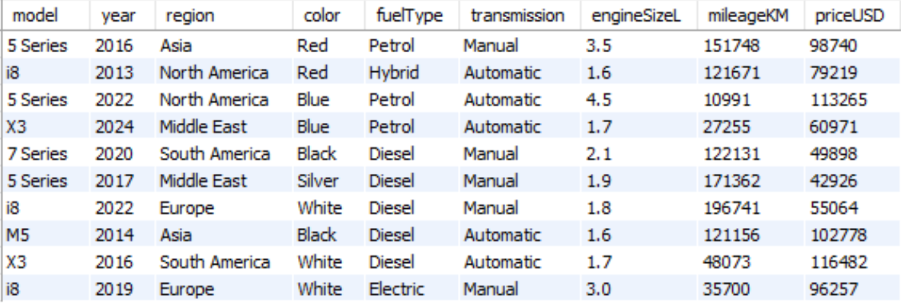
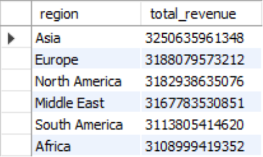
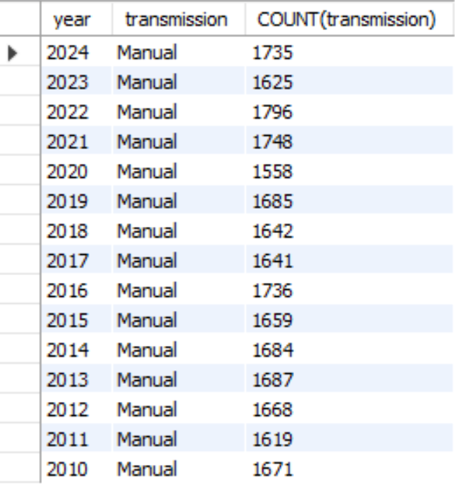
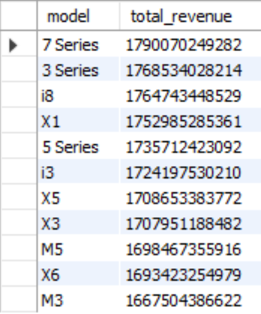
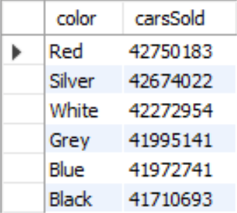
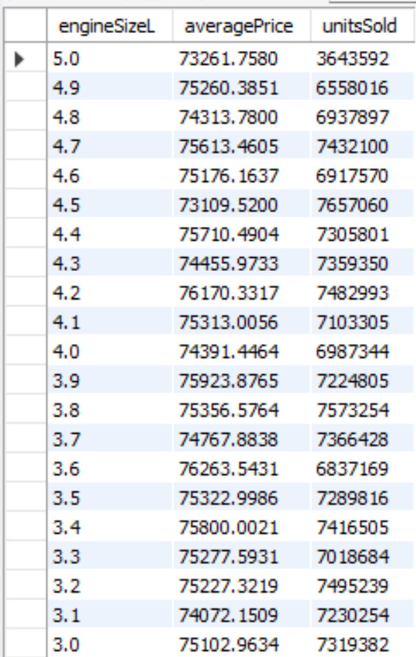
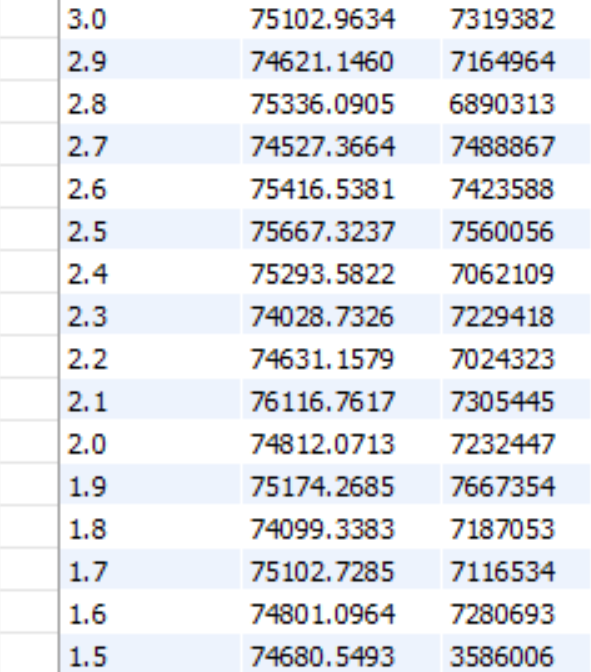
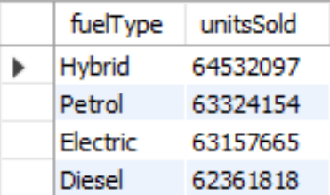
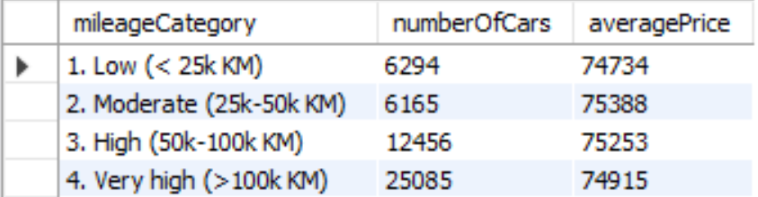

# BMW Sales Analysis

## Project Overview
**Role:** Data Analyst  
**Tools:** MySQL, MySQL Workbench, Python (Matplotlib/Seaborn)  
**Goal:** To analyze sales data for used BMW vehicles to identify profitability trends, depreciation patterns, and popular inventory specifications.

---

## Key Insights

### First 10 rows of the dataset



### 1. Revenue by region
*Objective: Identify which regions generate the most revenue to target marketing efforts.*

**SQL Query:**
```sql
SELECT region, SUM(priceUSD * salesVolume) as total_revenue
FROM cars
GROUP BY region
ORDER BY total_revenue DESC;
```



### 2. Number of manual cars sold over time
*Objective: Identify any trends of the number of manual cars sold between the years.*
**SQL Query:**
```sql
SELECT year, transmission, COUNT(transmission)
FROM cars
WHERE transmission = 'manual'
GROUP BY year, transmission
ORDER BY transmission, year DESC;
```



### 3. Amount of revenue per car model
*Objective: Explore which car model brings the most revenue to the company.*
**SQL Query:**
```sql
SELECT model, SUM(priceUSD * salesVolume) AS total_revenue
FROM cars
GROUP BY model
ORDER BY total_revenue DESC;
```




### 4. Number of cars sold based on its color
*Objective: Try to see if certain car colors are more preffered than others.*

**SQL Query:**
```sql
SELECT color, SUM(salesVolume) AS carsSold
FROM cars
GROUP BY color
ORDER BY carsSold DESC;
```




### 5. Average price of the car and units sold based on car's engine size. 
*Objective: Try to explore the relationship between a car's engine size and its price/popularity.*

**SQL Query:**
```sql
SELECT engineSizeL, AVG(priceUSD) AS averagePrice, SUM(salesVolume) AS unitsSold
FROM cars
GROUP BY engineSizeL
ORDER BY engineSizeL DESC;
```





### 6. Popularity of cars based on fuel type.
*Objective: Compare the sales amounts of different fuel type cars.*

**SQL Query:**
```sql
SELECT fuelType, SUM(salesVolume) AS unitsSold
FROM cars
GROUP BY fuelType
ORDER BY unitsSold DESC;
```



### 7. Car price based on its mileage
*Objective: See if the car's price is proportional to its mileage.*
```sql
SELECT 
	CASE
		WHEN mileageKM < 25000 THEN '1. Low (< 25k KM)'
		WHEN mileageKM BETWEEN 25000 AND 50000 THEN '2. Moderate (25k-50k KM)' 
		WHEN mileageKM BETWEEN 50000 AND 100000 THEN '3. High (50k-100k KM)'
		WHEN mileageKM > 100000 THEN '4. Very high (>100k KM)'
	END AS mileageCategory,
    COUNT(*) AS numberOfCars,
	ROUND(AVG(priceUSD), 0) AS averagePrice
FROM cars
GROUP BY mileageCategory
ORDER BY mileageCategory;
```

