# BMW Sales Analysis

## Project Overview
**Role:** Data Analyst  
**Tools:** MySQL, MySQL Workbench, Python (Matplotlib/Seaborn)  
**Goal:** To analyze used BMW vehicle listings to identify pricing trends, depreciation patterns, and popular inventory specifications.

---

## Dataset
The dataset was sourced from Kaggle and contains individual used BMW vehicle listings with the following columns: `model`, `year`, `region`, `color`, `fuelType`, `transmission`, `engineSizeL`, `mileageKM`, and `priceUSD`.

> **Note:** The dataset originally contained `salesVolume` and `salesClassification` columns, which were dropped prior to analysis. The `salesVolume` values were inconsistent with a per-listing dataset and appeared to be synthetically generated, producing unrealistic revenue figures when aggregated. Each row in this dataset represents a single used car listing.

---

## Key Insights

### First 10 rows of the dataset

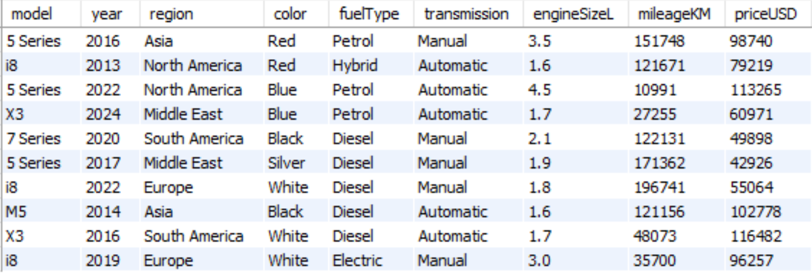

---

### 1. Average listing price by region
*Objective: Identify which regions have the highest average listing prices to target marketing efforts.*

**SQL Query:**
```sql
SELECT region,
       COUNT(*) AS total_listings,
       AVG(priceUSD) AS avg_price,
       MIN(priceUSD) AS min_price,
       MAX(priceUSD) AS max_price
FROM cars
GROUP BY region
ORDER BY avg_price DESC;
```

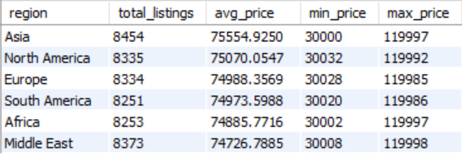
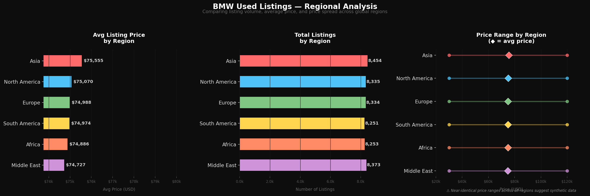

---

### 2. Number of manual cars listed over time
*Objective: Identify any trends in the number of manual transmission listings between years.*

**SQL Query:**
```sql
SELECT year, transmission, COUNT(transmission)
FROM cars
WHERE transmission = 'manual'
GROUP BY year, transmission
ORDER BY transmission, year DESC;
```

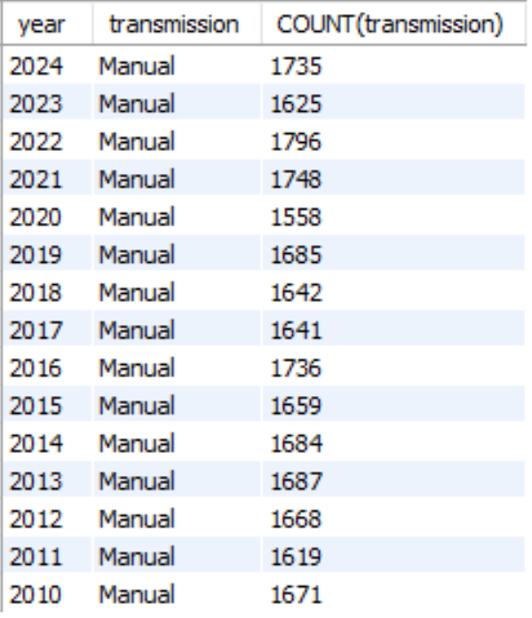
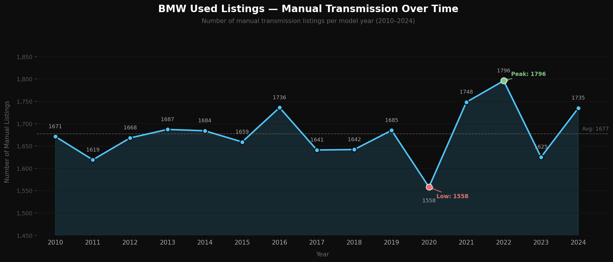

---

### 3. Average listing price and mileage per car model
*Objective: Explore which car models command the highest average listing prices.*

**SQL Query:**
```sql
SELECT model,
       COUNT(*) AS total_listings,
       ROUND(AVG(priceUSD), 2) AS avg_price,
       ROUND(AVG(mileageKM), 0) AS avg_mileage
FROM cars
GROUP BY model
ORDER BY avg_price DESC;
```

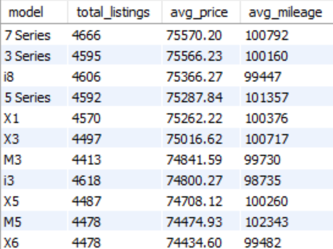
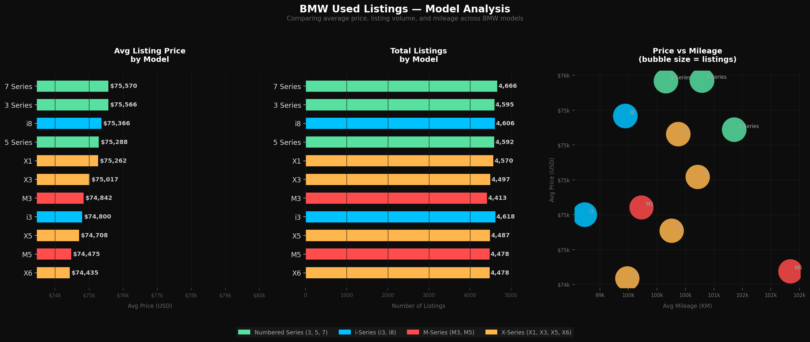

---

### 4. Listing volume and average price by color
*Objective: Identify which car colors are most common and whether color affects listing price.*

**SQL Query:**
```sql
SELECT color,
       COUNT(*) AS total_listings,
       ROUND(AVG(priceUSD), 2) AS avg_price
FROM cars
GROUP BY color
ORDER BY total_listings DESC;
```

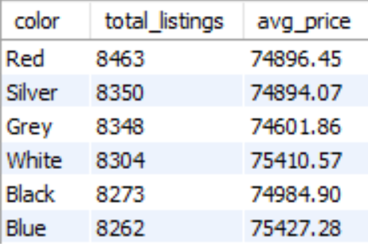
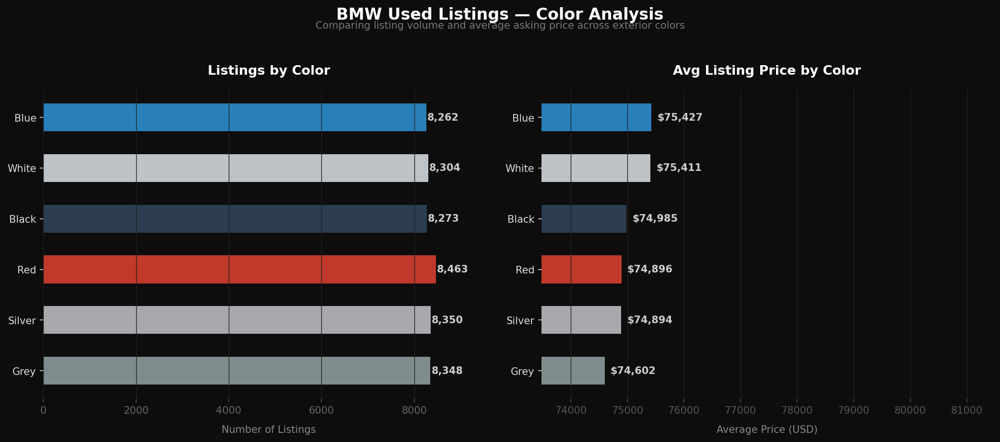

---

### 5. Engine size vs. average price and mileage
*Objective: Explore the relationship between engine size, average listing price, and mileage.*

**SQL Query:**
```sql
SELECT engineSizeL,
       COUNT(*) AS total_listings,
       ROUND(AVG(priceUSD), 2) AS avg_price,
       ROUND(AVG(mileageKM), 0) AS avg_mileage
FROM cars
GROUP BY engineSizeL
ORDER BY avg_price DESC;
```

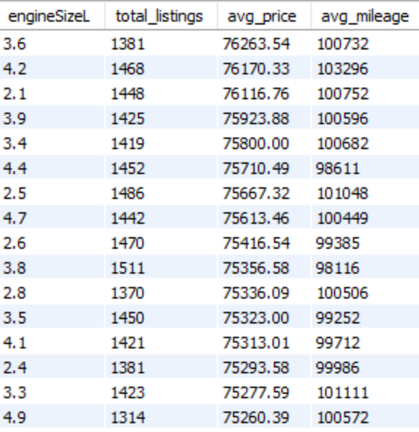
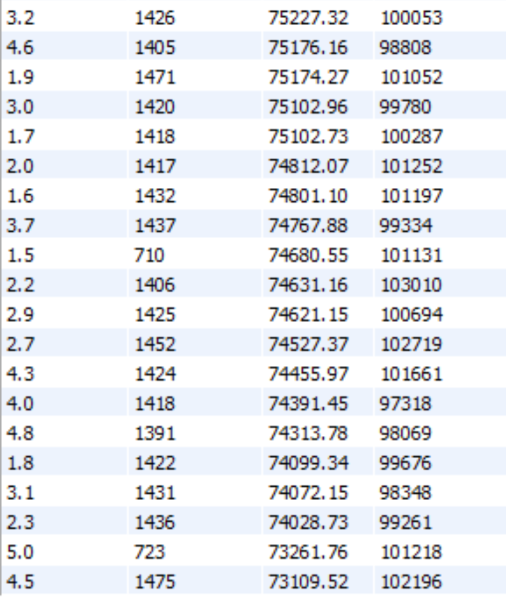
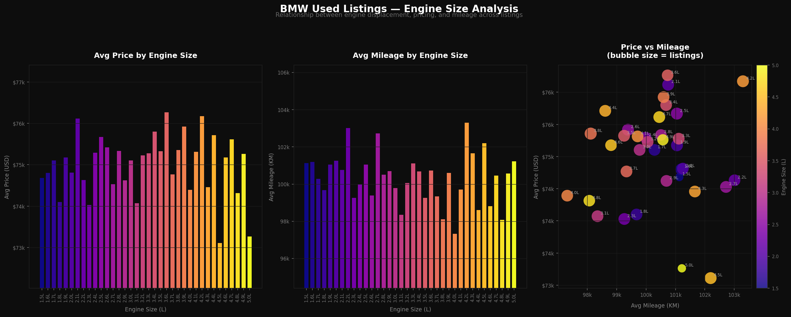

---

### 6. Listing volume and average price by fuel type
*Objective: Compare listing volume and average price across different fuel types.*

**SQL Query:**
```sql
SELECT fuelType,
       COUNT(*) AS total_listings,
       ROUND(AVG(priceUSD), 2) AS avg_price,
       ROUND(AVG(mileageKM), 0) AS avg_mileage
FROM cars
GROUP BY fuelType
ORDER BY total_listings DESC;
```

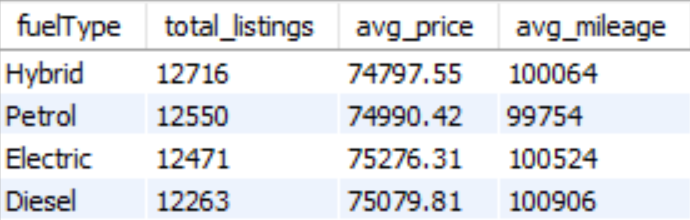
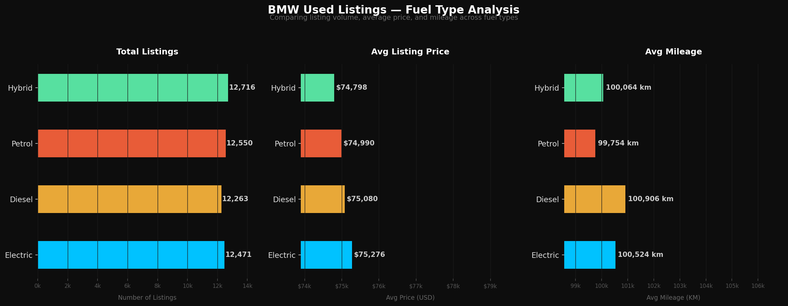

---

### 7. Average listing price by mileage category
*Objective: Examine how mileage affects average listing price to identify depreciation patterns.*

**SQL Query:**
```sql
SELECT
    CASE
        WHEN mileageKM < 25000 THEN '1. Low (< 25k KM)'
        WHEN mileageKM BETWEEN 25000 AND 50000 THEN '2. Moderate (25k-50k KM)'
        WHEN mileageKM BETWEEN 50000 AND 100000 THEN '3. High (50k-100k KM)'
        WHEN mileageKM > 100000 THEN '4. Very high (>100k KM)'
    END AS mileageCategory,
    COUNT(*) AS numberOfCars,
    ROUND(AVG(priceUSD), 0) AS averagePrice
FROM cars
GROUP BY mileageCategory
ORDER BY mileageCategory;
```

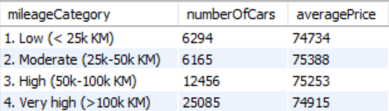
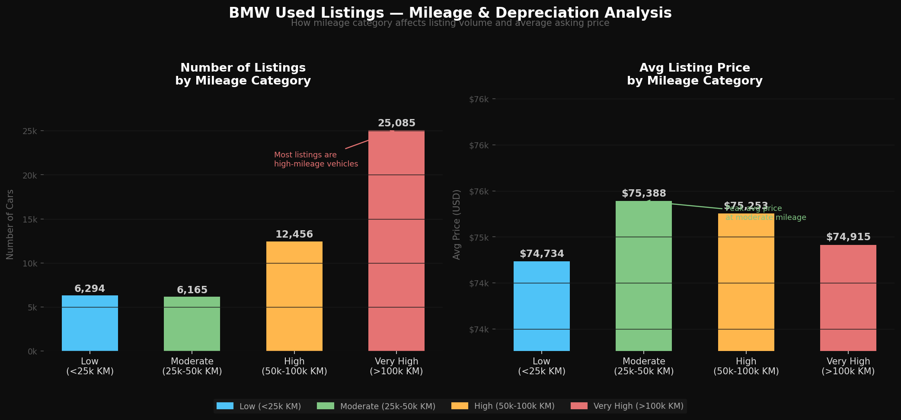

---
## Limitations & Data Quality Findings

During the analysis, several indicators suggested that this dataset is synthetically generated
rather than sourced from real BMW sales records. The following anomalies were identified:

**1. The `salesVolume` column**
The dataset contains a `salesVolume` column which is inconsistent with a per-listing dataset.
Each row represents a single used car listing, meaning a `salesVolume` of 7,949 on one row
would imply that exact vehicle sold nearly 8,000 times, which is of course, impossible. When used in
revenue calculations (`SUM(priceUSD * salesVolume)`), this produced aggregated totals in the
trillions of dollars per region, far exceeding BMW's real-world global revenue across all years
combined. Both `salesVolume` and `salesClassification` were dropped prior to analysis.

**2. Uniform listing counts across regions**
After dropping the problematic columns, a query grouping listings by region revealed that all
6 regions (Asia, Europe, North America, Middle East, South America, Africa) had near-identical
listing counts ranging from 8,251 to 8,454. In real used car market data, listing volume would
be heavily skewed, namely China and Europe alone dominate BMW sales by a wide margin.

**3. Near-identical average prices across regions**
Average listing prices across all regions fell within a range of $800.
Real-world pricing varies significantly by region due to various factors such as import duties, local taxes, currency
fluctuations, and demand. All of this makes this level of uniformity statistically impossible.

**4. Near-identical price ranges across regions**
Every region showed a minimum price of 30,000 and a maximum of 119,997, which is an almost
identical spread across 6 geographically distinct markets, which would not occur in real data.

---

As a result, absolute figures in this analysis should not be interpreted as reflective of
real-world BMW market conditions. The project is best understood as a demonstration of
SQL querying, data exploration, and most importantly, as the ability to identify and critically
evaluate data quality issues before drawing conclusions.